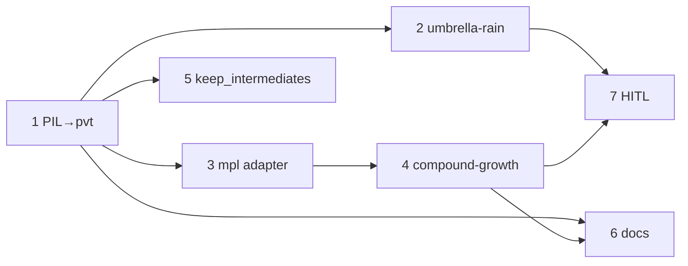

# 小红书 Live Photo 通用导出 — 任务拆分

**父级文档**：[xhs-live-photo-export.md](./xhs-live-photo-export.md)

**开发方式**：测试驱动（推荐）；纵向 tracer bullet，每条切片交付可单独验证的端到端路径。任务 **2** 与 **3** 在任务 **1** 完成后可**并行**领取。

**相关 case_id**：`umbrella-rain`（迁移）、`compound-growth`（新建示范）

---

## 任务总览

| # | 标题 | 类型 | 阻塞于 | 用户故事 | 并行 |
|---|------|------|--------|----------|------|
| 1 | 环境与 `_common`：PIL 帧 → `.pvt` 最小闭环 | AFK | — | 1, 2, 5, 6, 10 | — |
| 2 | `umbrella-rain` 迁公共导出；bundle 去掉 GIF | AFK | 1 | 3, 9 | 可与 3 并行 |
| 3 | `_common` matplotlib 帧适配器 | AFK | 1 | 4 | 可与 2 并行 |
| 4 | `compound-growth` 示范 case 端到端 | AFK | 1, 3 | 8 | — |
| 5 | `keep_intermediates`：稳定期仅保留 `.pvt` | AFK | 1 | 7 | 可与 2/3/4 并行（仅依赖 1） |
| 6 | README 与发布 runbook | AFK | 1, 4 | 1 | — |
| 7 | 真机验收：AirDrop → 相册 → 小红书 | HITL | 2 或 4 | 1 | — |



**已确认决策**

- **GIF**：`export_animation_bundle` **不再**生成 GIF；**保留** `export_animation(..., path.suffix==".gif")` 作为显式开发入口（非小红书主路径）。
- **失败策略**：Live 导出严格失败（非 macOS / 缺依赖 / 编码失败均抛错）。
- **中间产物**：v1 默认保留 `.jpg`/`.mov`；任务 5 增加 `keep_intermediates=False`。

运行命令（与项目规则一致）：

```bash
conda env update -f environment.yml   # 含 pip: makelive
conda run -n math python -m pytest -q
conda run -n math python -m ruff check .
```

---

## 任务 1：环境与 `_common`：PIL 帧 → `.pvt` 最小闭环

**类型**：AFK  
**阻塞于**：无，可立即开始  
**覆盖用户故事**：1, 2, 5, 6, 10

### 要做什么

在 `solve/_common` 落地 Live Photo **深模块**底层：接收 RGB `PIL.Image` 帧列表，经 letterbox（默认 720×960 白底）→ 首帧 JPEG → MOV（`ffmpeg`）→ `makelive` 打包为 `.pvt`；返回结构化结果（至少含 `pvt` 路径，调试期含 `jpg`/`mov`）。非 macOS、无 `ffmpeg`、无 `makelive`、空帧等情形**立即抛错**并说明原因。用 2–3 张硬编码帧在 macOS 上验证端到端。

### 验收标准

- [ ] `environment.yml` 的 `pip:` 包含 `makelive`；`ffmpeg` 仍由 conda 提供
- [ ] 公共 API：letterbox、从帧列表导出 Live（默认 `fps=10`，尺寸可覆盖）
- [ ] 默认 `keep_intermediates=True`，同时写出 `.jpg`、`.mov`、`.pvt`
- [ ] 单测：letterbox 输出默认尺寸；空帧/非法输入抛错；非 `Darwin` 调用 Live 导出抛错
- [ ] `@pytest.mark.slow`：在 `Darwin` 上硬编码帧导出 `.pvt` 存在且可识别为包目录
- [ ] `pytest` 能发现 `_common` 测试（扩展 `testpaths` 或等价配置）
- [ ] `ruff check` 通过

---

## 任务 2：`umbrella-rain` 迁公共导出；bundle 去掉 GIF

**类型**：AFK  
**阻塞于**：1（可与任务 3 并行）  
**覆盖用户故事**：3, 9

### 要做什么

将 `umbrella-rain` 中 letterbox、MOV 合成、`.pvt` 打包逻辑**改为调用** `_common`；`viz` 保留雨伞几何与 `frames_builder` / `_capture_animation_frames`。`export_animation_bundle` **仅**走 Live 导出，**移除** bundle 内的 GIF 生成；缺 Live 依赖时**抛错**，不再 `return None`。

**保留**：`export_animation(..., ".gif")` 等**显式**后缀开发入口，供 `test_export_animation_gif` 类单测与本地调试；该路径不属于小红书发布主链路。

### 验收标准

- [ ] `export_all_media` / `export_animation_bundle` 产出 `scene_*_live`（`.pvt`），**不**再产出 `scene_*_gif`
- [ ] `test_export_all_media_to_ami` 已更新：移除对 GIF 的断言；`Darwin` 仍断言 `.pvt` 包
- [ ] `test_export_animation_gif`（或等价）仍绿——验证显式 `.gif` 开发入口
- [ ] `test_letterbox_image_matches_live_photo_size` 仍绿（经 `_common` 或薄封装）
- [ ] 几何与其它 `viz` 单测无回归
- [ ] `./solve/umbrella-rain/run.sh` 在 macOS 上可跑通并写入 `ami/umbrella-rain/`

---

## 任务 3：`_common` matplotlib 帧适配器

**类型**：AFK  
**阻塞于**：1（可与任务 2 并行）  
**覆盖用户故事**：4

### 要做什么

在 `_common` 提供上层适配：调用方传入 `frames_builder(i)`、`n_frames`、画布 `figsize`/`dpi`；适配器复用单个 `matplotlib` Figure 逐帧渲染、转为 RGB 帧列表，再调用任务 1 的 PIL 导出。不依赖任何具体题目几何。

### 验收标准

- [ ] 适配器输出帧数等于 `n_frames`
- [ ] 单测：最小 `frames_builder`（如移动一条线）在非 `Darwin` 上对 Live 导出抛错；在 `Darwin` slow 测产出 `.pvt`
- [ ] 不引入 `umbrella-rain` 依赖
- [ ] `ruff` / `_common` 测试通过

---

## 任务 4：`compound-growth` 示范 case 端到端

**类型**：AFK  
**阻塞于**：1, 3  
**覆盖用户故事**：8

### 要做什么

新建 `compound-growth` 作为**流程样板**（非核心业务题）：同一坐标系内 `y=x²` 与 `y=1.01^x` 随进度「生长」；时间轴 **快—慢—快**，在数值求得的**交点**附近放慢并高亮（点/辅助线/简短中文标注）。竖屏 9:16 绘图，经公共 letterbox 导出 Live。提供 `run` 入口；产物**仅**写入 `ami/compound-growth/`。

### 验收标准

- [ ] `solve/compound-growth/` 包结构、`run.sh`（或等价）与 `pytest.ini` 的 `pythonpath`/`testpaths`
- [ ] 单测：进度 easing 单调；交点附近帧索引/时间权重符合预期（容差）
- [ ] `@pytest.mark.slow` + `Darwin`：`run` 生成 `.pvt`
- [ ] 根 README **Cases** 表增加 `compound-growth` 一行
- [ ] 不使用 GIF 作为该 case 的主导出

---

## 任务 5：`keep_intermediates=False`：稳定期仅保留 `.pvt`

**类型**：AFK  
**阻塞于**：1（可与 2/3/4 并行）  
**覆盖用户故事**：7

### 要做什么

为公共导出增加 `keep_intermediates`（默认 `True`）。为 `False` 时：成功打包 `.pvt` 后**不保留**或**删除**已写的 `.jpg`/`.mov`，使 `ami` 目录仅留 `.pvt`（及包内内容）。

### 验收标准

- [ ] 默认行为不变（仍写出 jpg/mov/pvt）
- [ ] `keep_intermediates=False` 时，导出目录无残留 `.jpg`/`.mov`（或从未写入）
- [ ] 单测覆盖 True/False 两种模式（可用 mock `makelive` 在非 `Darwin` 验证文件集合）

---

## 任务 6：README 与发布 runbook

**类型**：AFK  
**阻塞于**：1, 4  
**覆盖用户故事**：1

### 要做什么

更新根 README：Live 导出依赖（macOS、`makelive`、`ffmpeg`）、Cases 表、`PYTHONPATH` 提示。新增简短 **runbook**（建议 `docs/compound-growth/runbook.md` 或 `_common` 下发布说明）：`conda` → `run` → **AirDrop `.pvt` 包**（勿只传散装 jpg/mov）→ 相册确认 Live → 小红书发实况。

### 验收标准

- [ ] README 含 macOS-only Live 说明与 `compound-growth` 运行示例
- [ ] runbook 可被未读 PRD 的协作者按步骤执行
- [ ] 与 PRD「不在范围内」一致（不写小红书客户端逐步截图级教程，除非 HITL 任务 7 补充）

---

## 任务 7：真机验收：AirDrop → 相册 → 小红书

**类型**：HITL  
**阻塞于**：2 **或** 4（至少一个 case 已产出 `.pvt`）  
**覆盖用户故事**：1

### 要做什么

由人在 iPhone 上验证：`umbrella-rain` 和/或 `compound-growth` 的 `.pvt` 经 AirDrop 导入相册后可 Live 播放；小红书发布流程能选择**实况图**。失败时记录现象（尺寸、时长、打包方式）并回馈对应 AFK 任务。

### 验收标准

- [ ] 至少 1 个 `.pvt` 真机 Live 播放成功
- [ ] 小红书发帖入口识别为实况（文字结论或截图存档）
- [ ] 若失败：Issue/本文件备注根因与建议修复方向

---

## 领取顺序建议

| 阶段 | 可领取任务 |
|------|------------|
| 第一波 | **1** |
| 第二波（并行） | **2**、**3**、**5** |
| 第三波 | **4**（需 3 完成）、**6**（需 4 完成） |
| 验收 | **7**（需 2 或 4） |

---

**状态**：任务 1–6 已实现（2026-06-02）；任务 7（真机验收）待 HITL。
